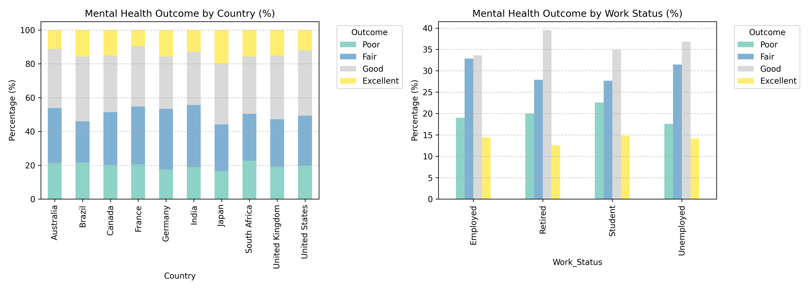
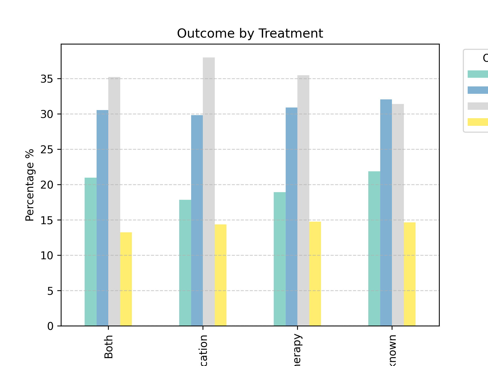
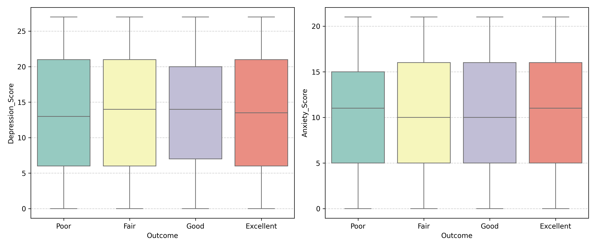
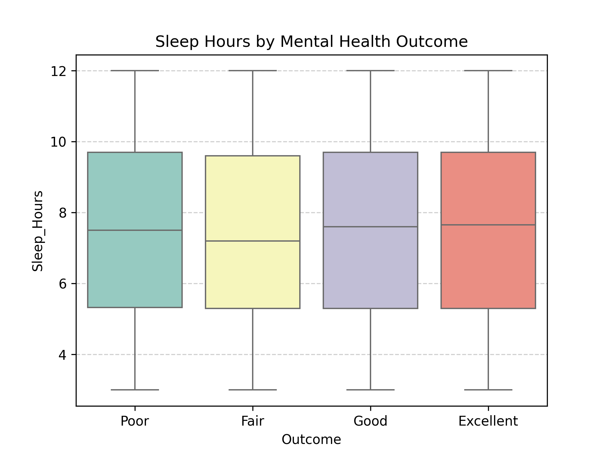
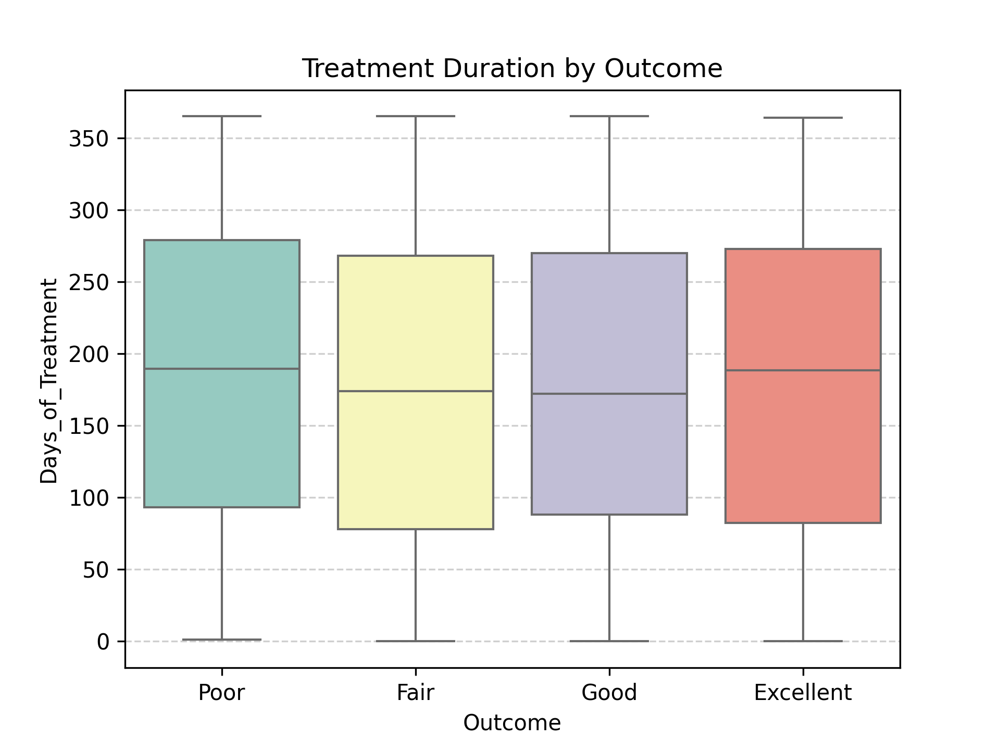
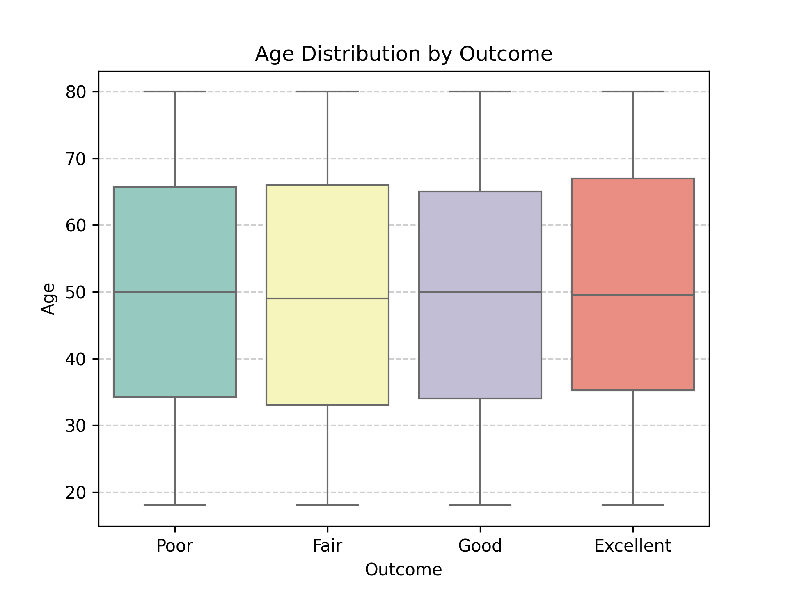
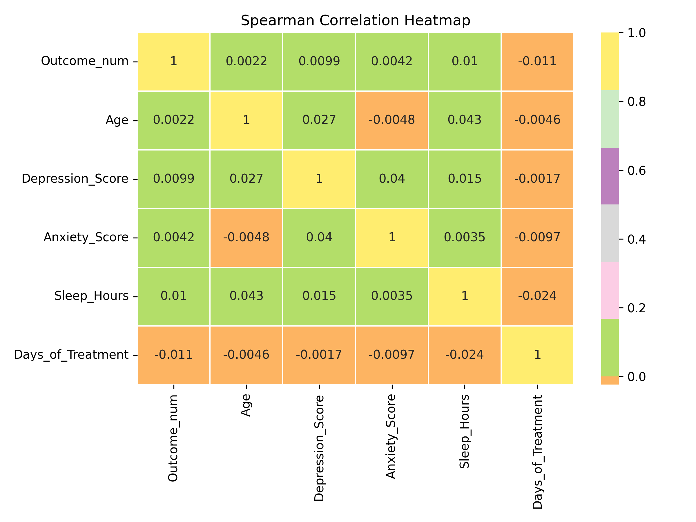

# FINAL PROJECT: FACTORS AFFECTING MENTAL HEALTH OUTCOMES
This is the final project of the Data Analyst course. It is about analyzing Global Mental Health data to draw relevant conclusions.
# Mental Health Global 2025 Analysis

## Project Goals
- Analyze global mental health data to identify factors associated with mental health outcomes.  
- Examine how demographic, clinical, lifestyle, and treatment-related factors affect mental health outcomes.  
- Provide actionable insights and recommendations to improve mental health care and well-being.  

---

## Data Sources
- **Dataset:** Mental Health Global 2025
- **Source:** https://www.kaggle.com/datasets/ankushnarwade/global-mental-health-dataset-2025/data.
- **Description:**
  + The dataset contains 2500 records and 15 columns
  + The last updated time of the dataset: 18/12/2025
  + Each record represents an anonymous patient
- **Structure:**
  + `Patient_ID:` Unique anonymized identifier assigned to each patient record
  + `Age:` Age of the individual in years (18 to 80)
  + `Gender:` Gender of the patient
  + `Country:` Country of residence of the patient
  + `Depression_Score:` Depression severity score based on the PHQ-9 scale (0–27)
  + `Anxiety_Score:` Anxiety severity score based on the GAD-7 scale (0–21)
  + `Stress_Level:` Self-reported stress level (Low, Medium, High, Severe)
  + `Sleep_Hours :` Average number of hours slept per night
  + `Physical_Activity:` Level of regular physical activity (None, Low, Moderate, High)
  + `Chronic_Illness:` Indicates presence of any ongoing physical health condition (Yes/No)
  + `Mental_Health_History:` Whether the patient has a prior mental health diagnosis (Yes/No)
  + `Treatment:` Type of mental health treatment received (None, Therapy, Medication, Both)
  + `Days_of_Treatment:` Total number of days the patient has undergone treatment
  + `Outcome:` Overall treatment outcome or mental health status (Poor, Fair, Good, Excellent)
  + `Work_Status:` Current employment or academic status of the patient
- **Data Overview:**

|      | Patient_ID   |   Age | Gender   | Country       |   Depression_Score |   Anxiety_Score | Stress_Level   |   Sleep_Hours | Physical_Activity   | Chronic_Illness   | Mental_Health_History   | Treatment   |   Days_of_Treatment | Outcome   | Work_Status   |
|-----:|:-------------|------:|:---------|:--------------|-------------------:|----------------:|:---------------|--------------:|:--------------------|:------------------|:------------------------|:------------|--------------------:|:----------|:--------------|
| 2380 | MH2381       |    63 | Male     | Germany       |                 20 |              19 | Medium         |           6.4 | Moderate            | No                | No                      | Therapy     |                 344 | Fair      | Employed      |
| 2062 | MH2063       |    52 | Male     | Brazil        |                 19 |              15 | Severe         |           7.5 | Moderate            | No                | Yes                     | Medication  |                 182 | Poor      | Retired       |
|  511 | MH0512       |    19 | Male     | Australia     |                 15 |               2 | Low            |           8.4 | Low                 | No                | Yes                     | Both        |                 284 | Excellent | Student       |
|    3 | MH0004       |    32 | Female   | Australia     |                 19 |              16 | Low            |          10   | Moderate            | No                | Yes                     | Both        |                 254 | Excellent | Employed      |
| 1346 | MH1347       |    19 | Female   | United States |                  0 |              21 | Medium         |          10.5 | Moderate            | No                | Yes  | Unknown     |                 264 | Good      | Student       |

---

## Tools and Technologies Applied
- **Programming Language:** Python 3.x  
- **Libraries:** pandas, matplotlib, seaborn, statsmodels, numpy, OrderedModel, scikit-learn

```python
#Import the following libraries
import pandas as pd
import matplotlib.pyplot as plt
import seaborn as sns
import statsmodels.api as sm
import numpy as np
# Import a statistical model specifically for ordinal dependent variables.
from statsmodels.miscmodels.ordinal_model import OrderedModel
```

- **Analysis Techniques:**  
  - Data cleaning & preprocessing:
    - Check range & logical numeric columns
    - Check each record represents an anonymous patient
    - Check consistency data, correct data types
    - Handlle missing value:
      ```python
      df['Physical_Activity'].fillna(df['Physical_Activity'].mode()[0],inplace=True)
      df['Treatment'].fillna('Unknown', inplace=True)
      ```
  - Exploratory Data Analysis (EDA): The dataset was divided into the following variable groups for analysis to understand their influence on the Outcome variable:
      -  Demographics: Age, Gender, Country, Employment Status
      -  Clinical: Depression Score, Anxiety Score, Chronic Disease, Stress Level, Mental Health History
      -  Lifestyle: Hours of Sleep, Physical Activity
      -  Treatment: Treatment Method, Number of Treatment Days
  - Correlation analysis: Use Spearman Correlation because Outcome is ordinal data.  
  - Visualization (Bar Plots, Box Plots, Heatmaps)  
  - Ordinal Logistic Regression: I use Ordinal Logistic Regression because the target variable has ordered categories. This model accounts for the natural order of the outcome, unlike standard or multinomial logistic regression.  

---

## Key insights discovered
### Demographic factors: Country and Work_Status: influence outcomes; Age, Gender: negligible impact

<p align="center">
  
</p>

_**Country:**_ These patterns suggest that country-level context plays an important role in shaping mental health outcomes.
  - South Africa and Brazil exhibit a higher proportion of **Poor** mental health outcomes compared to other countries, while their share of **Excellent** outcomes is relatively lower.
  - In contrast, Japan stands out with the lowest percentage of **Poor** outcomes and the highest percentage of **Excellent** outcomes. Japan shows better mental health outcomes.
    
_**Work_Status:**_ Mental health outcomes vary more clearly across different work status groups.
  - Retired has a ratio **Good** Outcome highest (about 40%).
  -  Student the highest percentage of "Poor" outcome (about 23%). The percentage of "Good" outcome was lower compared to other groups (Retired & Unemployed).
  - Employed the lowest Good outcome ratio and the highest Fair outcome ratio compared to other groups.
  - These  suggest that work status is more strongly associated with mental health outcomes, reflecting the influence of social and economic context on mental well-being. Among them, **Students** and the **Employed** are the two groups at highest risk. 

### Clinical: Stress_Level influence outcomes

<p align="center">
  
</p>

Outcome distribution changes gradually with each level of stress. The Fair and Poor ratings increase progressively and are highest in the **Severe** group. The highest percentage of Good cases was in the **Low** and **Medium** groups, decreasing significantly in the **Severe** group. It indicating a negative relationship between stress severity and mental well-being.

### Other Factors: Minor or non-significant impact
  + Clinical: Depression_Score, Anxiety_Score, Chronic_Illness, Mental_Health_History
  + Lifestyle:  Sleep_Hours, Physical_Activity
  + Treatment: Treatment, Days_of_Treatment

<p align="center">
  
</p>
<p align="center">
  
  
  
</p>

### Correlation:
Analyze correlations among numerical variables to uncover potential linear relationships that may influence mental health outcomes.

```python
# 1. Encode Outcome convert to numeric ordinal (Poor < Fair < Good < Excellent)
outcome_map = {'Poor': 0, 'Fair': 1, 'Good': 2, 'Excellent': 3}
df['Outcome_num'] = df['Outcome'].map(outcome_map)

# 2. Select numeric variables
numeric_cols = ['Outcome_num','Age', 'Depression_Score', 'Anxiety_Score', 'Sleep_Hours', 'Days_of_Treatment']
df_corr = df[numeric_cols]

# 3. Spearman correlation
corr_matrix = df_corr.corr(method='spearman')

plt.figure(figsize=(8,6))
sns.heatmap(corr_matrix,annot=True,cmap='Set3',center=0,linewidths=0.5)

plt.title('Spearman Correlation Heatmap')
plt.savefig('project/charts/spearman_correlation_heatmap.png',dpi=300)
plt.show()
```

<p align="center">
  
</p>
The Spearman coefficients between Outcome_num and the other variables are all close to 0, indicating no significant monotonic relationship exists between Outcome and these variables.
This is consistent with overlapping Boxplots that did not show much difference previously.

### Ordinal Logistic Regression:
Since the outcome variable represents ordered mental health levels (Poor to Excellent), ordinal logistic regression is an appropriate method to model the probability of achieving better outcomes while controlling for multiple factors simultaneously.
```python
# Ordinal-encoded Outcome
df['Outcome_ord'] = pd.Categorical(
    df['Outcome'],
    categories=outcome_sort,
    ordered=True
).codes
df['Outcome_ord']

# Encode Stress_Level ( Low <  Medium < High < Severe)
stress_map = {'Low': 0, 'Medium': 1, 'High': 2, 'Severe': 3}
df['Stress_num'] = df['Stress_Level'].map(stress_map)
df['Stress_num'] = df['Stress_num'].astype(int)

# Encode Physical_Activity ( Low <  Moderate < High)
activity_map = {'Low': 0, 'Moderate': 1, 'High': 2}
df['Activity_num'] = df['Physical_Activity'].map(activity_map)
df['Activity_num'] = df['Activity_num'].astype(int)

# Encode Chronic_Illness (Yes/No)
df['Chronic_Illness_bin'] = df['Chronic_Illness'].map({
    'No': 0,
    'Yes': 1
})
df['Chronic_Illness_bin'] = df['Chronic_Illness_bin'].astype(int)

# Encode Mental_Health_History (Yes/No)
df['Mental_Health_History_bin'] = df['Mental_Health_History'].map({
    'No': 0,
    'Yes': 1
})
df['Mental_Health_History_bin'] = df['Mental_Health_History_bin'].astype(int)
# Convert categorical nominal variables into multiple binary columns (0/1)
X = pd.get_dummies(df[['Stress_num','Activity_num',
    'Chronic_Illness_bin','Mental_Health_History_bin',
    'Work_Status','Country','Treatment',
    'Age', 'Depression_Score', 'Anxiety_Score', 'Sleep_Hours', 'Days_of_Treatment',]]
                   ,drop_first=True)

# Convert column with boolean value to integer
bool_cols = X.select_dtypes(include='bool').columns
X[bool_cols] = X[bool_cols].astype(int)


y = df['Outcome_ord']
model_ord = OrderedModel(y,X,distr='logit')
result_ord = model_ord.fit(method='bfgs')
print(result_ord.summary())
```
Result:

|                           |    coef |   std err |      z |    P\>\|z\| |   [0.025 |   0.975] |
|:--------------------------|--------:|----------:|-------:|--------:|---------:|---------:|
| Stress_num                | -0.0368 |     0.037 | -1.004 |   0.315 |   -0.109 |    0.035 |
| Activity_num              |  0.0087 |     0.054 |  0.159 |   0.874 |   -0.098 |    0.115 |
| Chronic_Illness_bin       | -0.0052 |     0.08  | -0.065 |   0.948 |   -0.161 |    0.151 |
| Mental_Health_History_bin |  0.1349 |     0.074 |  1.82  |   0.069 |   -0.01  |    0.28  |
| Age                       |  0.0001 |     0.002 |  0.066 |   0.947 |   -0.004 |    0.004 |
| Depression_Score          |  0.002  |     0.005 |  0.451 |   0.652 |   -0.007 |    0.011 |
| Anxiety_Score             |  0.001  |     0.006 |  0.167 |   0.867 |   -0.01  |    0.012 |
| Sleep_Hours               |  0.0053 |     0.014 |  0.374 |   0.708 |   -0.022 |    0.033 |
| Days_of_Treatment         | -0.0002 |     0     | -0.63  |   0.529 |   -0.001 |    0     |
| Work_Status_Retired       |  0.0463 |     0.135 |  0.344 |   0.731 |   -0.218 |    0.31  |
| Work_Status_Student       | -0.0057 |     0.09  | -0.064 |   0.949 |   -0.181 |    0.17  |
| Work_Status_Unemployed    |  0.0955 |     0.099 |  0.964 |   0.335 |   -0.099 |    0.29  |
| Country_Brazil            |  0.2423 |     0.168 |  1.446 |   0.148 |   -0.086 |    0.571 |
| Country_Canada            |  0.1541 |     0.166 |  0.928 |   0.353 |   -0.171 |    0.479 |
| Country_France            | -0.0302 |     0.164 | -0.184 |   0.854 |   -0.352 |    0.291 |
| Country_Germany           |  0.1495 |     0.162 |  0.925 |   0.355 |   -0.167 |    0.466 |
| Country_India             |  0.0324 |     0.165 |  0.196 |   0.845 |   -0.292 |    0.357 |
| Country_Japan             |  0.4468 |     0.167 |  2.681 |   0.007 |    0.12  |    0.773 |
| Country_South Africa      |  0.1291 |     0.167 |  0.775 |   0.438 |   -0.197 |    0.456 |
| Country_United Kingdom    |  0.2433 |     0.167 |  1.458 |   0.145 |   -0.084 |    0.57  |
| Country_United States     |  0.1447 |     0.168 |  0.859 |   0.39  |   -0.185 |    0.475 |
| Treatment_Medication      |  0.1449 |     0.109 |  1.329 |   0.184 |   -0.069 |    0.359 |
| Treatment_Therapy         |  0.095  |     0.105 |  0.906 |   0.365 |   -0.111 |    0.301 |
| Treatment_Unknown         | -0.0546 |     0.111 | -0.494 |   0.622 |   -0.271 |    0.162 |
| 0/1                       | -1.1294 |     0.239 | -4.731 |   0     |   -1.597 |   -0.662 |
| 1/2                       |  0.3614 |     0.033 | 11.1   |   0     |    0.298 |    0.425 |
| 2/3                       |  0.5754 |     0.031 | 18.632 |   0     |    0.515 |    0.636 |

Country (Japan) significant: Odds Ratio ~1.56 → 56% higher likelihood of better outcome.
Other demographic, clinical, lifestyle, and treatment-related variables did not exhibit statistically significant effects within this multivariate framework.

---

## Hypotheses based on the insights
Based on the analysis results, we propose the following hypotheses:
- The Complexity of Psychiatry: Mental health does not depend solely on individual numbers (such as hours of sleep or physical activity) but is a combination of many hidden factors not yet included in this dataset.
- External Factors: Living environment (Country) and occupational stress (Job Status) may be the most important "confounding variables" or independent variables requiring further study.
---

## Recommendations based on analysis results
- Results suggest that structural and contextual factors such as country and work status play a more important role in mental health outcomes than individual clinical or lifestyle variables.
- Mental health strategies should therefore prioritize country-level policies, workplace interventions, and preventive care rather than focusing solely on individual treatment.
- Incorporating additional socioeconomic and contextual variables, such as income, access to healthcare, and social support, will help to better understand the determinants of mental health. Improvements in data collection and measurement should be made to more detailed data.

---

## Limitations
This study has several limitations. Most notably, the dataset lacks key socioeconomic and environmental variables, such as income, healthcare access, and social support, which restricts the ability to fully explain variations in mental health outcomes across individuals and countries.

---
📬 Author

_Dương Ngọc Phượng_
_Data Analysis Graduation Project – 2025_

---
